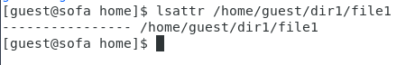
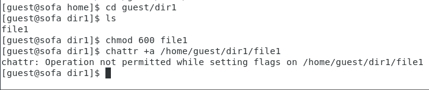
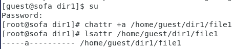
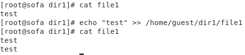
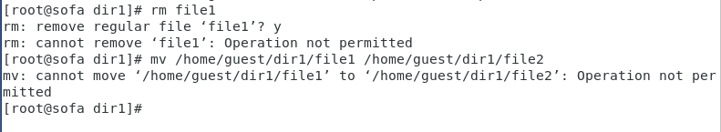
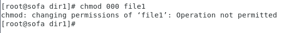
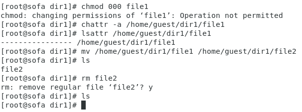
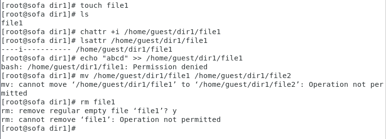

Лабораторная работа 

№4

Ломакина София Васильевна НФИбд-02-19

Цель лабораторной работы

Получение практических навыков работы в консоли с расширенными атрибутами файлов.

Установка прав и расширенных атрибутов

Установка расширенных атрибутов и проверка

Операции с файлом file1

Повторение операций с файлом file1

Расширенный атрибут i

Вывод

В результате проделанной лабораторной работы были получены практические навыки работы в консоли с расширенными атрибутами файлов.!
