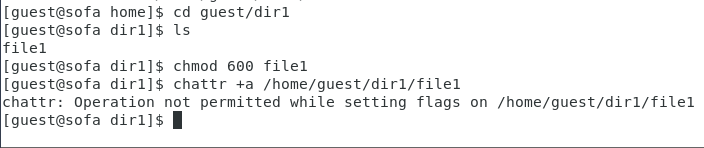
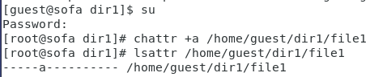
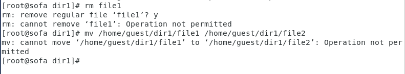
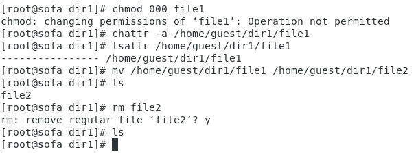
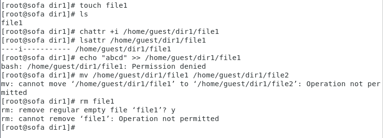

**РОССИЙСКИЙ УНИВЕРСИТЕТ ДРУЖБЫ НАРОДОВ**

**Факультет физико-математических и естественных наук**

**ОТЧЕТ**

**ПО ЛАБОРАТОРНОЙ РАБОТЕ № 4**

*Дисциплина: Информационная безопасность*

*Тема: Дискреционное разграничение прав в Linux. Расширенные атрибуты*

Студент: Ломакина София Васильевна Группа: НФИбд-02-19

**МОСКВА** 2022 г.

*Цель работы*

Цель лабораторной работы No4 - получение практических навыков работы в консоли с расширенными атрибутами файлов.

*Выполнение лабораторной работы*

От имени пользователя guest определила расширенные атрибуты файла /home/guest/dir1/file1 командой lsattr /home/guest/dir1/file1.

Установила командой chmod 600 file1 на файл file1 права, разрешающие чтение и запись для владельца файла. Попробовала установить на файл /home/guest/dir1/file1 расширенный атрибут a от имени пользователя guest с помощью команды chattr +a /home/guest/dir1/file1. В ответ был получен отказ от выполнения операции.

Зашла в другом окне консоли с правами администратора и попробовала установить расширенный атрибут a на файл /home/guest/dir1/file1 от имени суперпользователя с помощью команды chattr +a /home/guest/dir1/file1.

От пользователя guest проверила правильность установления атрибута с помощью команды lsattr /home/guest/dir1/file1.

Выполнила дозапись в файл file1 слова «test» командой echo » “test” /home/guest/dir1/file1. После этого выполнила чтение файла file1 командой cat /home/guest/dir1/file1. Убедилась, что слово test было успешно записано в file1.

Попробовала удалить и переименовать файл file1. В обоих случаях был получен отказ от выполнения операции.

Попробовала с помощью команды chmod 000 file1 установить на файл file1 права, запрещающие чтение и запись для владельца файла. При выполнении команды был получен отказ от выполнения операции.

Сняла расширенный атрибут a с файла /home/guest/dirl/file1 от имени суперпользователя командой chattr -a /home/guest/dir1/file1.

После повторила операции, которые ранее не удалось выполнить. Все операции были выполнены успешно.

Повторила все действия по шагам, заменив атрибут «a» атрибутом «i». При этом дозаписать информации в файл не удалось в связи с отказом от выполнения операции.

*Вывод*

В ходе выполнения лабораторной работы были получены практические навыки работы в консоли с расширенными атрибутами файлов.
