Лабораторная работа

№5

Ломакина София Васильевна НФИбд-02-19

Цель лабораторной работы

Изучение механизмов изменения идентификаторов, применения SetUID- и Sticky-битов. Получение практических навыков работы в консоли с дополнительными атрибутами. Рассмотрение работы механизма смены идентификатора процессов пользователей, а также влияние бита Sticky на запись и удаление файлов.

Подготовка лабораторного стенда

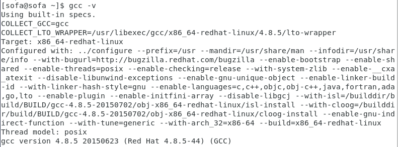

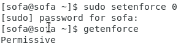

Создание программы simpleid.c

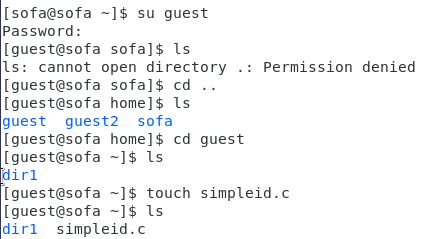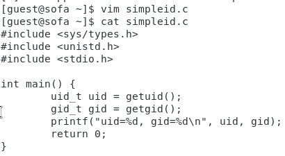

Компиляция и выполнение программы simpleid

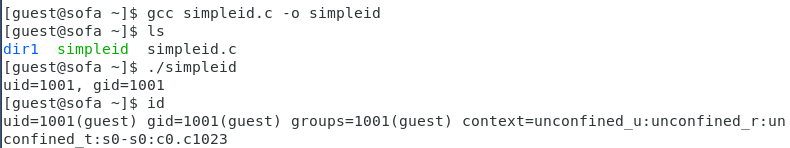

Создание программы simpleid2.c

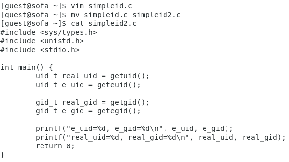

Компиляция и выполнение программы simpleid2

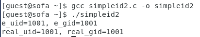

Изменение владельца и атрибутов simpleid2

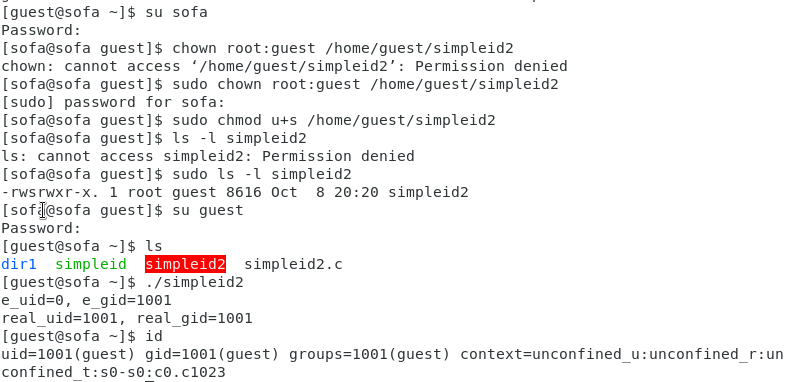

Повторение операций для SetGID-бита

Создание программы readfile.c

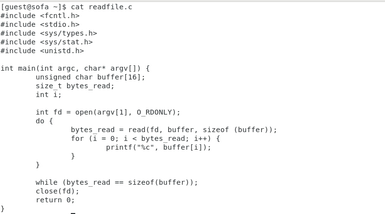Компиляция. Смена владельца и изменение прав файла readfile.c

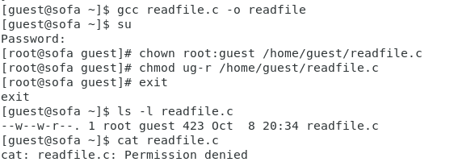

Операции с программой readfile

Смена владельца программы readfile и установка SetUID-бита. Чтение файла readfile.c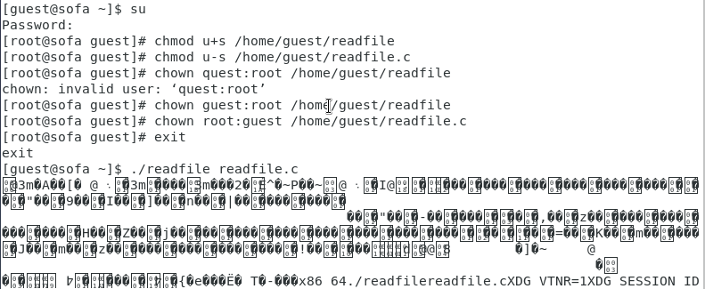

Чтение файла /etc/shadow  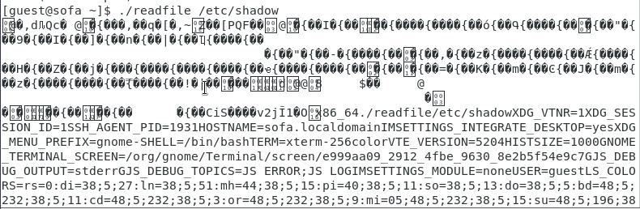

Проверка Sticky атрибута. Создание файла file1

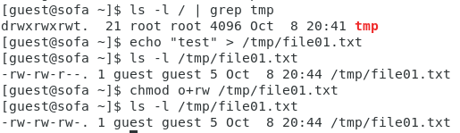

Операции с файлом file01.txt

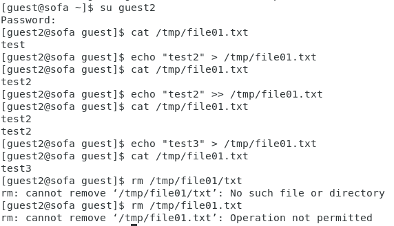

Снятие t атрибута с директории /tmp

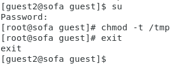

Операции с файлом file01.txt после снятия t атрибута

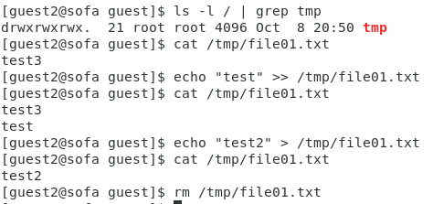

Возвращение t атрибута директории /tmp

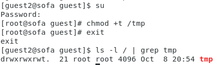

Вывод

В результате проделанной лабораторной работы были изучены механизмы изменения идентификаторов, применения SetUID- и Sticky-битов, получены практические навыки работы в консоли с дополнительными атрибутами, а также рассмотрены работы механизма смены идентификатора процессов пользователей и влияние бита Sticky на запись и удаление файлов.
