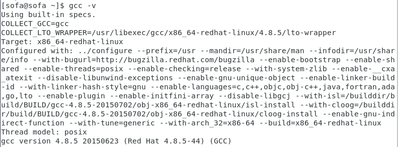
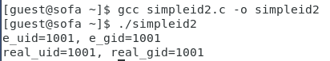
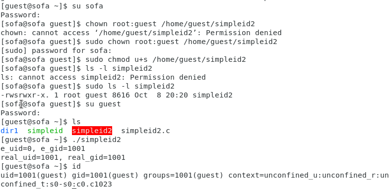
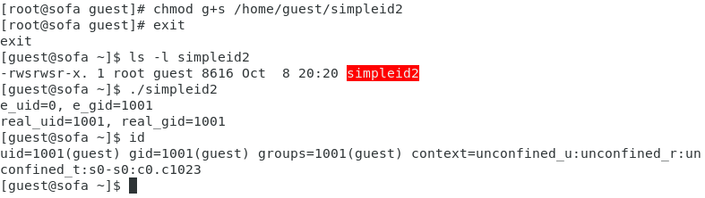
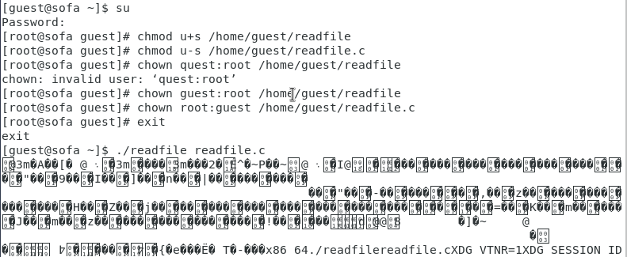
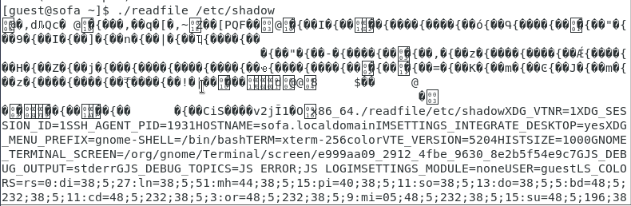
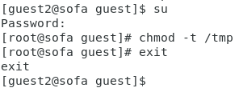
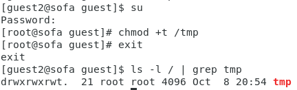

**РОССИЙСКИЙ УНИВЕРСИТЕТ ДРУЖБЫ НАРОДОВ**

**Факультет физико-математических и естественных наук**

**ОТЧЕТ**

**ПО ЛАБОРАТОРНОЙ РАБОТЕ № 5**

*Дисциплина: Информационная безопасность*

*Тема: Дискреционное разграничение прав в Linux. Исследование влияния дополнительных атрибутов*

Студент: Ломакина София Васильевна Группа: НФИбд-02-19

**МОСКВА** 2022 г.

[**Цель работы](#_page2_x85.05_y56.70) **[2**](#_page2_x85.05_y56.70)**

[**Выполнение лабораторной работы](#_page2_x85.05_y188.61) **[2** ](#_page2_x85.05_y188.61)[Подготовка лабораторного стенда](#_page2_x85.05_y242.84)** [2 ](#_page2_x85.05_y242.84)[Создание программы](#_page2_x85.05_y651.07) [3 ](#_page2_x85.05_y651.07)[Исследование Sticky-бита](#_page7_x85.05_y514.96) [8](#_page7_x85.05_y514.96)

[**Вывод](#_page9_x85.05_y694.21) **[10**](#_page9_x85.05_y694.21)**

*Цель работы*

Изучение механизмов изменения идентификаторов, применения SetUID- и Sticky- битов. Получение практических навыков работы в консоли с дополнительными атрибутами. Рассмотрение работы механизма смены идентификатора процессов пользователей, а также влияние бита Sticky на запись и удаление файлов.

*Выполнение лабораторной работы*

*Подготовка лабораторного стенда*

Убедилась, что в системе установлен компилятор gcc, введя команду gcc -v. Также проверила отключение систему запретов до очередной перезагрузки системы командой getenforce, которая вывела Permissive.

*Создание программы*

Вошла в систему от имени пользователя guest и создала программу simpleid.c со следующим кодом:

Скомпилировала программу с помощью команды gcc simpleid.c -o simpleid и убедилась, что файл программы создан. Выполнила программу simpleid, а также системную программу id. Результат выполнения двух последних программ одинаков.

Усложнила программу, добавив вывод действительных идентификаторов и назвала получившуюся программу simpleid2.c.

Скомпилировала и запустила simpleid2.c.

От имени суперпользователя выполните команды chown root:guest /home/guest/simpleid2 и chmod u+s /home/guest/simpleid2, повысив права пользователя с помощью команды su и изменив владельца и атрибуты simpleid2. Выполнила проверку правильности установки новых атрибутов и смены владельца файла simpleid2 командой ls -l simpleid2, а также запустила simpleid2 и id. Результат выполнения программ отличается, поскольку программа simpleid2 выводит uid и gid владельца, а команда id - uid и gid текущего пользователя.

Проделала то же самое относительно SetGID-бита.

Создала программу readfile.c.

Откомпилируйте программу с помощью команды gcc readfile.c -o readfile. После от имени администратора сменила владельца у файла readfile.c и изменила права так, чтобы только суперпользователь (root) мог прочитать его, a guest не мог. Проверила, что пользователь guest не может прочитать файл readfile.c.

Сменила у программы readfile владельца и установила SetUID-бит. Выяснила, что программа readfile не может прочитать файл readfile.c.

Также выяснила, что программа readfile не может прочитать файл /etc/shadow.

*Исследование Sticky-бита*

Выяснила, установлен ли атрибут Sticky на директории /tmp, для чего выполнила команду ls -l / | grep tmp. Атрибут установлен. От имени пользователя guest создала файл file01.txt в директории /tmp со словом test с помощью команды echo “test” > /tmp/file01.txt. После просмотрела атрибуты у только что созданного файла и разрешила чтение и запись для категории пользователей «все остальные» с помощью команд ls -l /tmp/file01.txt, chmod o+rw /tmp/file01.txt и ls -l /tmp/file01.txt.

От пользователя guest2 (не являющегося владельцем) попробовала прочитать файл /tmp/file01.txt с помощью команды cat /tmp/file01.txt. После попробовала дозаписать в файл /tmp/file01.txt слово test2 командой echo “test2” > /tmp/file01.txt. Проверила содержимое файла командой cat /tmp/file01.txt. Далее попробовала записать в файл /tmp/file01.txt слово test3, стерев при этом всю имеющуюся в файле информацию командой echo “test3” > /tmp/file01.txt. Снова проверила содержимое файла командой cat /tmp/file01.txt. Попробовала удалить файл /tmp/file01.txt командой rm /tmp/file01.txt. Получилось выполнить все команды на запись и чтение, но не команду удаления файла.

Повысила свои права до суперпользователя командой su - и выполнила команду chmod -t /tmp, снимающую атрибут t (Sticky-бит) с директории /tmp. Покинула режим суперпользователя командой exit.

От пользователя guest2 проверила командой ls -l / | grep tmp, что атрибута t у директории /tmp нет. Повторила предыдущие шаги, причем в этот раз удалось удалить файл от имени пользователя, не являющегося владельцем файла file01.txt.

Повысила свои права до суперпользователя и вернула атрибут t на директорию /tmp.

*Вывод*

В ходе выполнения лабораторной работы были изучены механизмы изменения

идентификаторов, применения SetUID- и Sticky-битов, получены практические навыки работы в консоли с дополнительными атрибутами, а также рассмотрены работы механизма смены идентификатора процессов пользователей и влияние бита Sticky на запись и удаление файлов.
