Лабораторная работа

№6

Ломакина София Васильевна НФИбд-02-19

Цель лабораторной работы

Развитие навыков администрирования ОС Linux, первое практическое знакомство с технологией SELinux, а также проверка работы SELinx на практике совместно с веб-сервером Apache.

Проверка работы SELinux и веб-сервера

` `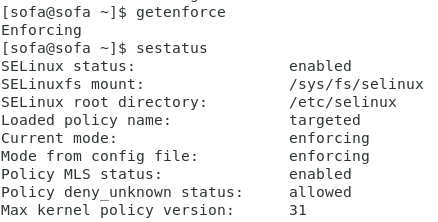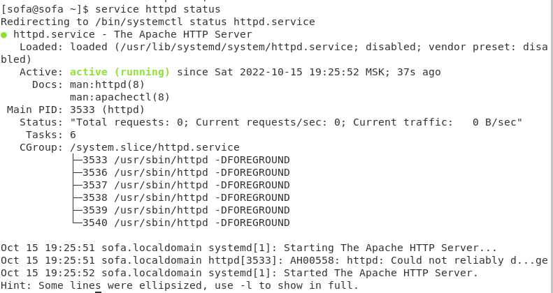

Веб-сервер Apache

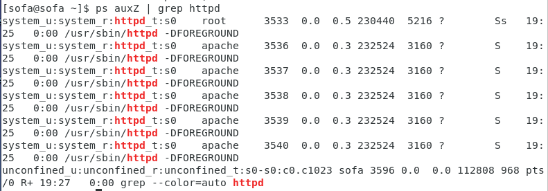

Состояние переключателей SELinux

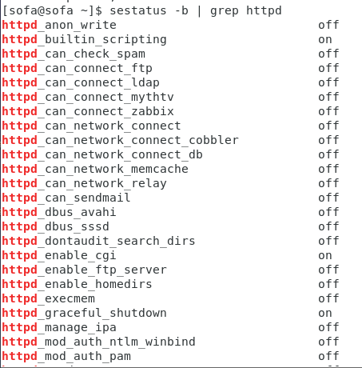

Команда seinfo

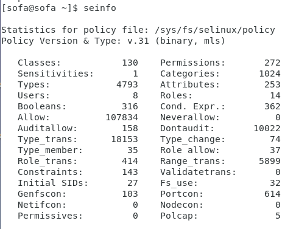

Тип файлов и поддиректорий

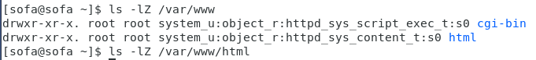

Создание html-файла /var/www/html/test.html

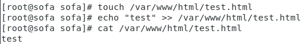

Обращение к файлу test.html

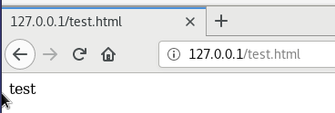

Контекст файла test.html

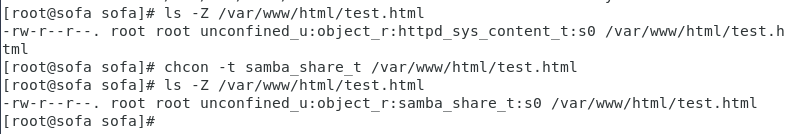

Повторное обращение к файлу test.html

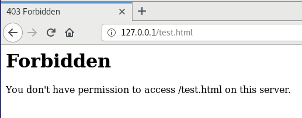

log-файлы веб-сервера Apache и системный log-файл

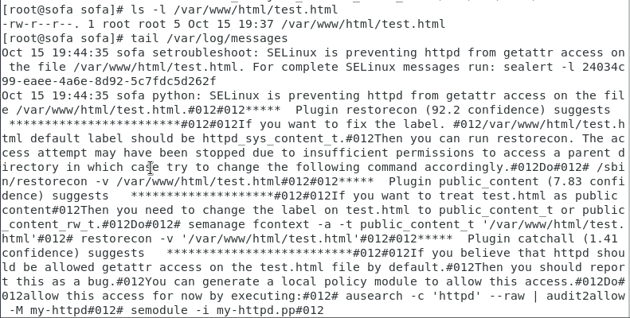

Запуск веб-сервера Apache на прослушивание ТСР-порта 81

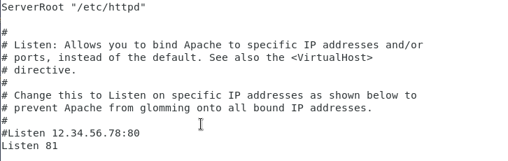

Просмотр log-файлов

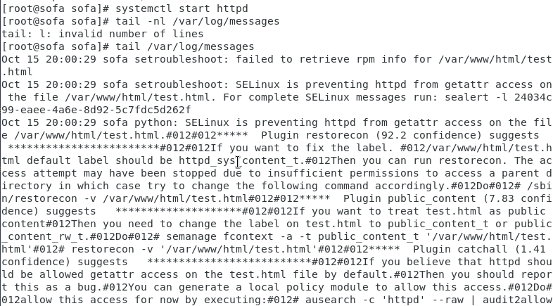

Вывод списка портов

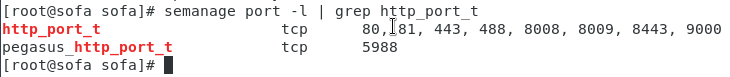

Возвращение контекста

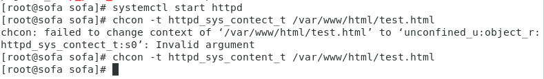

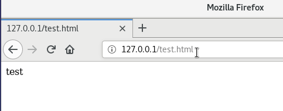

Удаление html файла

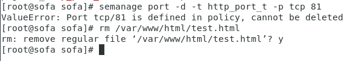

Вывод

В результате проделанной лабораторной работы были развиты навыки администрирования ОС Linux, получено первое практическое знакомство с технологией SELinux, а также была проверена работа SELinux на практике совместно с веб-сервером Apache.
