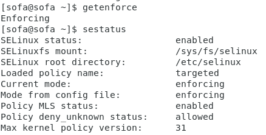
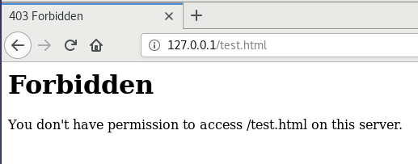
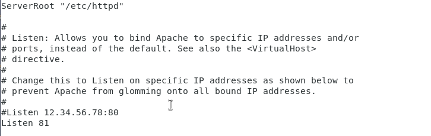
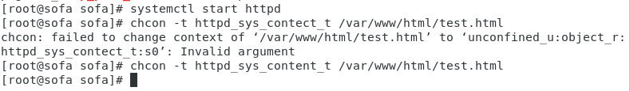
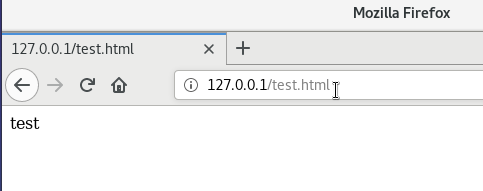

**РОССИЙСКИЙ УНИВЕРСИТЕТ ДРУЖБЫ НАРОДОВ**

**Факультет физико-математических и естественных наук**

**ОТЧЕТ**

**ПО ЛАБОРАТОРНОЙ РАБОТЕ № 6**

*Дисциплина: Информационная безопасность Тема: Мандатное разграничение прав в Linux*

Студент: Ломакина София Васильевна Группа: НФИбд-02-19

**МОСКВА** 2022 г.

[**Цель работы](#_page2_x85.05_y56.70) **[2**](#_page2_x85.05_y56.70)**

[**Выполнение лабораторной работы](#_page2_x85.05_y166.19) **[2** ](#_page2_x85.05_y166.19)**Подготовка лабораторного стенда 2 Создание программы 3 Исследование Sticky-бита 8

[**Вывод](#_page9_x85.05_y56.70) **[10**](#_page9_x85.05_y56.70)**

*Цель работы*

Развить навыки администрирования ОС Linux. Получить первое практическое знакомство с технологией SELinux. Проверить работу SELinx на практике совместно с веб-сервером Apache.

*Выполнение лабораторной работы*

Вошла в систему и убедилась, что SELinux работает в режиме enforcing политики targeted с помощью команд getenforce и sestatus. Обратилась к веб-серверу, запущенному на компьютере, и убедилась, что последний работает с помощью команды service httpd status.

Нашла веб-сервер Apache в списке процессов и определила его контекст безопасности, использовав команду ps auxZ | grep httpd.

Посмотрела текущее состояние переключателей SELinux для Apache с помощью команды sestatus -b | grep httpd. Многие из них находятся в положении «off».

Посмотрела статистику по политике с помощью команды seinfo и определила множество пользователей, ролей, типов.

Определила тип файлов и поддиректорий, находящихся в директории /var/www, с помощью команды ls -lZ /var/www. Определила тип файлов, находящихся в директории /var/www/html с помощью команды ls -lZ /var/www/html. Создание файлов в директории /var/www/html разрешено только root пользователю.

Создала от имени суперпользователя html-файл /var/www/html/test.html следующего содержания:

test

Обратилась к файлу через веб-сервер, введя в браузере адрес <http://127.0.0.1/test.html>. Файл был успешно отображён.

Изучила справку man httpd\_selinux и выяснила, какие контексты файлов определены для httpd. Проверила контекст файла ls -Z /var/www/html/test.html. При выполнении команды был получен контекст httpd\_sys\_content\_t, который позволяет процессу httpd получить доступ к файлу. Изменила контекст файла /var/www/html/test.html с httpd\_sys\_content\_t на samba\_share\_t с помощью команды chcon -t samba\_share\_t /var/www/html/test.html и проверила, что контекст поменялся с помощью команды ls -Z /var/www/html/test.html.

Попробовала ещё раз получить доступ к файлу через веб-сервер, введя в браузере адрес http://127.0.0.1/test.html. При выполнении команды получила сообщение об ошибке: Forbidden You don’t have permission to access /test.html on this server.

Просмотрела log-файлы веб-сервера Apache с помощью команды ls -l /var/www/html/test.html. Также просмотрела системный лог-файл командой tail /var/log/messages.

Попробовала запустить веб-сервер Apache на прослушивание ТСР-порта 81 (а не 80, как рекомендует IANA и прописано в /etc/services). Для этого в файле /etc/httpd/httpd.conf нашла строчку Listen 80 и заменила её на Listen 81.

Выполнила перезапуск веб-сервера Apache, при этом сбоя не произошло, поскольку порт 81 уже был определен.

Проанализировала лог-файлы с помощью команды tail -nl /var/log/messages. Просмотрела файлы /var/log/http/error\_log, /var/log/http/access\_log и /var/log/audit/audit.log.

Выполнила команду semanage port -a -t http\_port\_t -р tcp 81. После этого проверила список портов командой semanage port -l | grep http\_port\_t. Порт 81 в списке.

Вернула контекст httpd\_sys\_cоntent\_t к файлу /var/www/html/test.html командой chcon -t httpd\_sys\_content\_t /var/www/html/test.html. После этого попробовала получить доступ к файлу через веб-сервер, введя в браузере адрес <http://127.0.0.1:81/test.html>.

Исправила обратно конфигурационный файл apache, вернув Listen 80.

Удалила привязку http\_port\_t к 81 порту командой semanage port -d -t http\_port\_t -p tcp 81.

Удалила файл /var/www/html/test.html командой rm /var/www/html/test.html.

*Вывод*

В ходе выполнения лабораторной работы были развиты навыки администрирования ОС Linux, получено первое практическое знакомство с технологией SELinux, а также была проверена работа SELinux на практике совместно с веб-сервером Apache.
