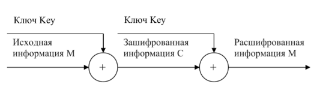
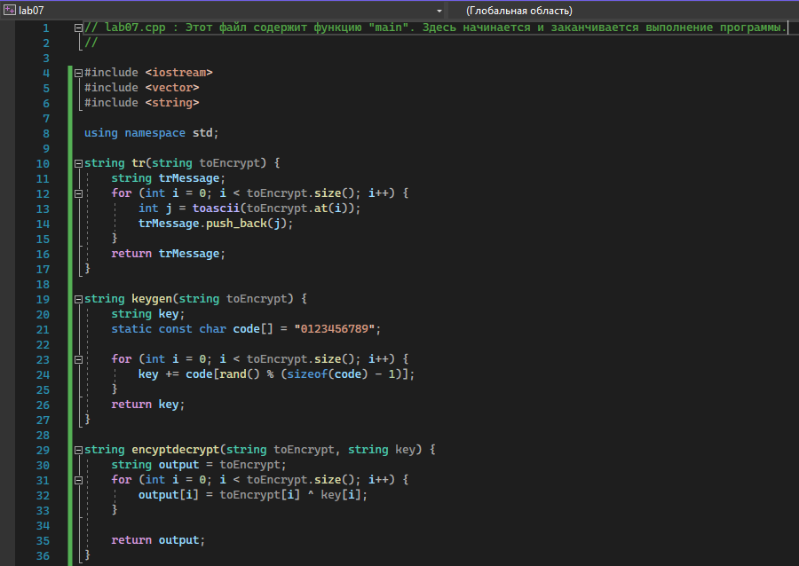
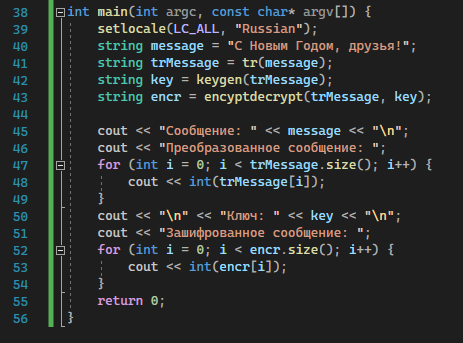
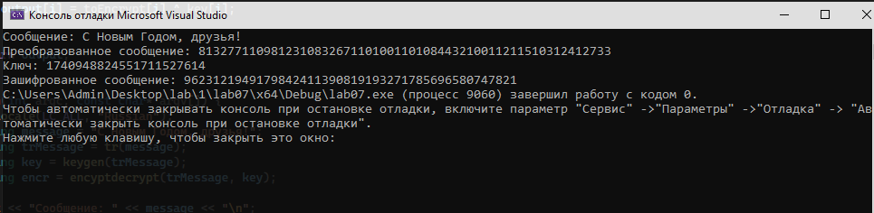

Лабораторная работа

№7

Ломакина София Васильевна НФИбд-02-19

Цель лабораторной работы

Освоить на практике применение режима однократного гаммирования.

Теоретическая справка

Гаммирование - наложение (снятие) на открытые (зашифрованные) данные последовательности элементов других данных, полученной с помощью некоторого криптографического алгоритма, для получения зашифрованных (открытых) данных. Наложение гаммы  это сложение её элементов с элементами открытого (закрытого) текста по некоторому фиксированному модулю, значение которого представляет собой известную часть алгоритма шифрования.

В соответствии с теорией криптоанализа, если в методе шифрования используется однократная вероятностная гамма (однократное гаммирование) той же длины, что и подлежащий сокрытию текст, то текст нельзя раскрыть. Даже при раскрытии части последовательности гаммы нельзя получить информацию о всём скрываемом тексте.

Рис. 1: Схема однократного использования Вернама

Если известны ключ и открытый текст, то задача нахождения шифротекста заключается в применении к каждому символу открытого текста следующего правила:

Ci = Pi ⊕ Ki

где Ci i-й символ получившегося зашифрованного послания, Pi i-й символ открытого текста, Ki i-й символ ключа, i = 1, m.

Функции программы-шифратора

main функция программы-шифратора

Результат работы программы-шифратора

Контрольные вопросы

1. Поясните смысл однократного гаммирования

Гаммирование - выполнение операции XOR между элементами гаммы и элементами подлежащего сокрытию текста. Если в методе шифрования используется однократная вероятностная гамма (однократное гаммирования)  той же длины, что и подлежащий сокрытию текст, то текст нельзя раскрыть. Даже при раскрытии части последовательности гаммы нельзя получить информацию о всем скрываемом тексте.

2. Перечислите недостатки однократного гаммирования

Абсолютная стойкость шифра доказана только для случая, когда однократно используемый ключ, длиной, равной длине исходного сообщения, является фрагментом истинно случайной двоичной последовательности с равномерным законом распределения.

3. Перечислите преимущества однократного гаммирования

Во-первых, такой способ симметричен, т.е. двойное прибавление одной и той же величины по модулю 2 восстанавливает исходное значение. Во-вторых, шифрование и расшифрование может быть выполнено одной и той же программой. Наконец, криптоалгоритм не дает никакой информации об открытом тексте: при известном зашифрованном сообщении С все различные ключевые последовательности К возможны и равновероятны, а значит, возможны и любые сообщения Р.

4. Почему длина открытого текста должны совпадать с длиной ключа?

Если ключ короче текста, то операция XOR будет применена не ко всем элементам и конец сообщения будет не закодирован. Если ключ будет длиннее, то появится неоднозначность декодирования.

5. Какая операция используется в режиме однократного гаммирования, назовите ее особенности? 

Наложение гаммы по сути представляет собой выполнения побитовой операции сложения по модулю 2, т.е. мы должны сложить каждый элемент гаммы с соответствующим элементом ключа. Данная операция является симметричной, так как прибавление одной и той же величины по модулю 2 восстанавливает исходное значение.

6. Как по открытому тексту и ключу получить шифротекст? В таком случае задача сводится к правилу:

Ci = Pi (+) Ki

т.е. мы поэлементно получаем символы зашифрованного сообщения, применяя операцию исключающего или к соответствующим элементам ключа и открытого текста.

7. Как по открытому тексту и шифротексту получить ключ?

Подобная задача решается путем применения операции исключающего или к последовательности символов зашифрованного и открытого сообщений:

Ki = Pi (+) Ci

8. В чем заключаются необходимые и достаточные условия абсолютной стойкости шифра? Необходимые и достаточные условия абсолютной стойкости шифра: 
- полная случайность ключа;
- равенство длин ключа и открытого текста;
- однократное использование ключа;

Вывод

В ходе выполнения лабораторной работы было освоено на практике применение режима однократного гаммирования.
