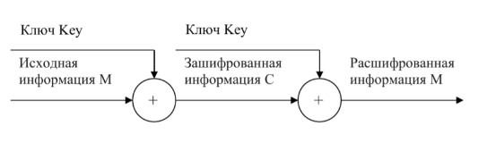
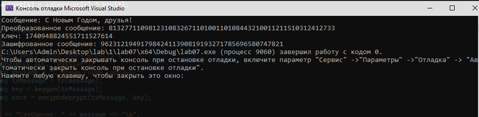

**РОССИЙСКИЙ УНИВЕРСИТЕТ ДРУЖБЫ НАРОДОВ**

**Факультет физико-математических и естественных наук**

**ОТЧЕТ**

**ПО ЛАБОРАТОРНОЙ РАБОТЕ № 7**

*Дисциплина: Информационная безопасность*

*Тема: Элементы криптографии. Однократное гаммирование*

Студент: Ломакина София Васильевна Группа: НФИбд-02-19

**МОСКВА** 2022 г.

[**Цель работы](#_page2_x85.05_y56.70) **[3** ](#_page2_x85.05_y56.70)[Теоретическая справка](#_page2_x85.05_y143.77) [3** ](#_page2_x85.05_y143.77)[Выполнение лабораторной работы](#_page3_x85.05_y706.97) [4** ](#_page3_x85.05_y706.97)[Контрольные вопросы](#_page5_x85.05_y249.76) [6** ](#_page5_x85.05_y249.76)[Вывод](#_page6_x85.05_y625.29) [7**](#_page6_x85.05_y625.29)**

*Цель работы*

Освоить на практике применение режима однократного гаммирования.

*Теоретическая справка*

Предложенная Г. С. Вернамом так называемая «схема однократного использования (гаммирования)» является простой, но надёжной схемой шифрования данных. Гаммирование представляет собой наложение (снятие) на открытые (зашифрованные) данные последовательности элементов других данных, полученной с помощью некоторого криптографического алгоритма, для получения зашифрованных (открытых) данных. Иными словами, наложение гаммы — это сложение её элементов с элементами открытого (закрытого) текста по некоторому фиксированному модулю, значение которого представляет собой известную часть алгоритма шифрования. В соответствии с теорией криптоанализа, если в методе шифрования используется однократная вероятностная гамма (однократное гаммирование) той же длины, что и подлежащий сокрытию текст, то текст нельзя раскрыть. Даже при раскрытии части последовательности гаммы нельзя получить информацию о всём скрываемом тексте.

Наложение гаммы по сути представляет собой выполнение операции сложения по модулю 2 (XOR) (обозначаемая знаком ⊕) между элементами гаммы и элементами подлежащего сокрытию текста. Напомним, как работает операция XOR над битами: 0 ⊕0 = 0, 0 ⊕1 = 1, 1 ⊕0 = 1, 1 ⊕1 = 0. Такой метод шифрования является симметричным, так как двойное прибавление одной и той же величины по модулю 2 восстанавливает исходное значение, а шифрование и расшифрование выполняется одной и той же программой.

Рис. 0.1: Схема однократного использования Вернама

Если известны ключ и открытый текст, то задача нахождения шифротекста заключается в применении к каждому символу открытого текста следующего правила:

Ci = Pi ⊕ Ki

, где Ci — i-й символ получившегося зашифрованного послания, Pi — i-й символ открытого текста, Ki — i-й символ ключа, i = 1, m. Размерности открытого текста и ключа должны совпадать, и полученный шифротекст будет такой же длины. Если известны шифротекст и открытый текст, то задача нахождения ключа решается также в соответствии с (7.1), а именно, обе части равенства необходимо сложить по модулю 2 с Pi:

Ci ⊕ Pi = Pi ⊕ Ki ⊕ Pi = Ki,

Ki = Ci ⊕ Pi

Открытый текст имеет символьный вид, а ключ — шестнадцатеричное представление. Ключ также можно представить в символьном виде, воспользовавшись таблицей ASCII-кодов. К. Шеннон доказал абсолютную стойкость шифра в случае, когда однократно используемый ключ, длиной, равной длине исходного сообщения, является фрагментом истинно случайной двоичной последовательности с равномерным законом распределения. Криптоалгоритм не дает никакой информации об открытом тексте: при известном зашифрованном сообщении C все различные ключевые последовательности K возможны и равновероятны, а значит, возможны и любые сообщения P. Необходимые и достаточные условия абсолютной стойкости шифра:

- полная случайность ключа;
- равенство длин ключа и открытого текста;
- однократное использование ключа.

*Выполнение лабораторной работы*

Написала следующую программу на C++, шифрующую введенное сообщение при

помощи случайно сгенерированного ключа.

Рис. 0.1: Функции программы-шифратора

Рис. 0.2: main функция программы-шифратора

Результат работы программы можно увидеть ниже:

*Контрольные вопросы*

1. Поясните смысл однократного гаммирования

Гаммирование - выполнение операции XOR между элементами гаммы и элементами подлежащего сокрытию текста. Если в методе шифрования используется однократная вероятностная гамма (однократное гаммирования)  той же длины, что и подлежащий сокрытию текст, то текст нельзя раскрыть. Даже при раскрытии части последовательности гаммы нельзя получить информацию о всем скрываемом тексте.

2. Перечислите недостатки однократного гаммирования

Абсолютная стойкость шифра доказана только для случая, когда однократно используемый ключ, длиной, равной длине исходного сообщения, является фрагментом истинно случайной двоичной последовательности с равномерным законом распределения.

3. Перечислите преимущества однократного гаммирования

Во-первых, такой способ симметричен, т.е. двойное прибавление одной и той же величины по модулю 2 восстанавливает исходное значение. Во-вторых, шифрование и расшифрование может быть выполнено одной и той же программой. Наконец, криптоалгоритм не дает никакой информации об открытом тексте: при известном зашифрованном сообщении С все различные ключевые последовательности К возможны и равновероятны, а значит, возможны и любые сообщения Р.

4. Почему длина открытого текста должны совпадать с длиной ключа?

Если ключ короче текста, то операция XOR будет применена не ко всем элементам и конец сообщения будет не закодирован. Если ключ будет длиннее, то появится

неоднозначность декодирования.

5. Какая операция используется в режиме однократного гаммирования, назовите ее особенности?

Наложение гаммы по сути представляет собой выполнения побитовой операции сложения по модулю 2, т.е. мы должны сложить каждый элемент гаммы с соответствующим элементом ключа. Данная операция является симметричной, так как прибавление одной и той же величины по модулю 2 восстанавливает исходное значение.

6. Как по открытому тексту и ключу получить шифротекст?

В таком случае задача сводится к правилу:

Ci = Pi (+) Ki

т.е. мы поэлементно получаем символы зашифрованного сообщения, применяя операцию исключающего или к соответствующим элементам ключа и открытого текста.

7. Как по открытому тексту и шифротексту получить ключ?

Подобная задача решается путем применения операции исключающего или к последовательности символов зашифрованного и открытого сообщений:

Ki = Pi (+) Ci

8. В чем заключаются необходимые и достаточные условия абсолютной стойкости шифра?

Необходимые и достаточные условия абсолютной стойкости шифра:

- полная случайность ключа;
- равенство длин ключа и открытого текста;
- однократное использование ключа;

*Вывод*

В ходе выполнения лабораторной работы было освоено на практике применение режима однократного гаммирования.
